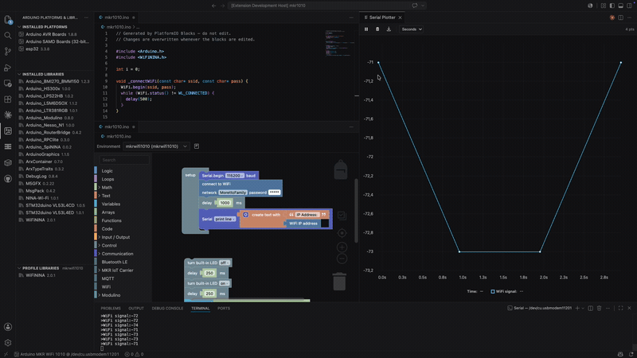

# Arduino Sketch Studio for VS Code

**Build and run the Arduino sketches you design with blocks — in plain VS Code.**



Design a sketch with drag-and-drop blocks in
**[Blocks Editor](https://marketplace.visualstudio.com/items?itemName=linucs.blocks-editor)**,
then compile, upload and monitor it here, without leaving the editor. This
extension is the **run half** of that workflow: Blocks Editor writes the sketch,
Arduino Sketch Studio puts it on the board and shows you what it's doing. Hand-written
sketches work exactly the same way — blocks are optional.

> **Not a replacement for the Arduino IDE.** The Arduino IDE is the full,
> all-in-one desktop app for developing sketches. This extension doesn't compete
> with it: it's a thin wrapper over the very same [`arduino-cli`](https://github.com/arduino/arduino-cli)
> the Arduino IDE uses under the hood, for people who'd rather drive that tool from
> the VS Code they already live in — with their own editor, extensions, themes and
> keybindings.

It's "just another Arduino CLI" by design. Arduino ships official command-line
tools — `arduino-cli` for sketches, `arduino-app-cli` for UNO Q apps — and this
extension gives the sketch one a native VS Code face, the same way its sibling
**[Arduino App CLI](https://marketplace.visualstudio.com/items?itemName=linucs.vscode-arduino-app-cli-ide)**
does for UNO Q apps. The CLI does the real work; VS Code does what it's already
great at.

## Why you'll like it

- 🧩 **The other half of Blocks Editor** — design a sketch with blocks, then
  compile and upload it here; no GUI round-trip, no leaving VS Code.
- 🪶 **Thin** — talks to the official `arduino-cli` daemon over local gRPC, so your
  builds behave exactly like the Arduino IDE's; no heavyweight runtime, no second IDE.
- 🧰 **Everything in the editor** — Compile, Upload, Serial Monitor, and Debug buttons sit right in the editor toolbar for any `.ino` file.
- 🔌 **Knows your board** — pick a board once; it's remembered, and it can auto-install the core you need.
- 📦 **Manage cores & libraries visually** — install, update, downgrade, and remove platforms and libraries from a sidebar — no memorizing commands.
- 📈 **Serial monitor _and_ plotter** — read text from your board, or graph live numbers as they stream in.
- 🐞 **Real debugging** — set breakpoints and step through code on supported boards.

## Getting started

### Step 1 — Install `arduino-cli` (required)

This extension **does not bundle** the Arduino toolchain — that's what keeps it thin. You install the official `arduino-cli` once, and the extension drives it.

- **macOS** (Homebrew): `brew install arduino-cli`
- **Windows** (winget): `winget install ArduinoSA.CLI`
- **Linux / manual**: follow the [official installation guide](https://arduino.github.io/arduino-cli/latest/installation/).

> Already have the **Arduino IDE 2.x**? It ships `arduino-cli` under the hood, but the extension needs it on your `PATH`. The simplest path is to install `arduino-cli` separately as above, or point the `arduinoCli.path` setting at the executable.

To check it worked, open a terminal and run `arduino-cli version`.

### Step 2 — Install this extension

Search for **"Arduino Sketch Studio"** in the VS Code Extensions view, or install from [Open VSX](https://open-vsx.org) on VSCodium / Cursor / Windsurf.

### Step 3 — Build your first sketch

1. Open a folder containing a sketch — an `.ino` file inside a folder of the same name (e.g. `Blink/Blink.ino`). Don't have one? Run **Arduino Sketch Studio: New Sketch…** from the Command Palette (`Ctrl/Cmd+Shift+P`).
2. Open the `.ino` file. You'll see **Compile**, **Upload**, **Serial Monitor**, and **Debug** buttons in the top-right editor toolbar.
3. Click **Select Board** (Command Palette → **Arduino Sketch Studio: Select Board**) and pick your board. If its core isn't installed yet, the extension offers to install it for you.
4. Plug in your board and click **Upload** (the ⬆ button). Watch progress in the output panel.
5. Click the **Serial Monitor** (🔌) button to see what your board prints back.

That's it — no project wizard, no IDE switch. Just VS Code.

## The Arduino sidebar

Click the **circuit board icon** in the Activity Bar to open **Arduino Platforms & Libraries**, with up to three tree views:

- **Installed Platforms** — every core you have, with inline buttons to upgrade, change version, or uninstall. Toolbar buttons install a new platform, refresh, or upgrade them all.
- **Installed Libraries** — every library you have, with the same inline controls. Toolbar buttons add a library, refresh, or upgrade all. You can also install from a **ZIP** file or a **Git URL**.
- **Profile Libraries** — appears when your sketch uses a `sketch.yaml` build profile; lists the libraries pinned to the active profile.

## What you can do

Everything below is available from the **Command Palette** (`Ctrl/Cmd+Shift+P`), the editor toolbar, or the sidebar.

**Build & run**

| Command | What it does |
|---------|-------------|
| Arduino Sketch Studio: Select Board | Choose the board (FQBN) for the current sketch |
| Arduino Sketch Studio: Compile | Compile the active sketch |
| Arduino Sketch Studio: Upload | Upload the compiled sketch to the board |
| Arduino Sketch Studio: Upload Using Programmer | Upload via a hardware programmer |
| Arduino Sketch Studio: Burn Bootloader | Write the bootloader to the board |
| Arduino Sketch Studio: Board Details | Show the selected board's capabilities |

**Serial**

| Command | What it does |
|---------|-------------|
| Arduino Sketch Studio: Open Serial Monitor | Read text from the board's serial port |
| Arduino Sketch Studio: Open Serial Plotter | Graph live numeric data streaming over serial |
| Arduino Sketch Studio: Save Serial Log… | Save the captured serial output to a file |
| Arduino Sketch Studio: Set Serial Line Ending | Choose what line ending is appended when sending to the board (None / NL / CR / NL+CR) |

**Platforms / cores**

| Command | What it does |
|---------|-------------|
| Arduino Sketch Studio: Install / Uninstall / Upgrade Platform | Manage a single core |
| Arduino Sketch Studio: Upgrade All Platforms | Update every installed core |
| Arduino Sketch Studio: Download Platform (cache only)… | Pre-download a core without installing |
| Arduino Sketch Studio: Update Package Index | Refresh the list of available cores |

**Libraries**

| Command | What it does |
|---------|-------------|
| Arduino Sketch Studio: Add Library… | Search and install a library |
| Arduino Sketch Studio: Install Library from ZIP… / from Git URL… | Install from a local archive or a repository |
| Arduino Sketch Studio: Download Library Archive (cache only)… | Pre-download a library without installing |
| Arduino Sketch Studio: Upgrade All Libraries | Update every installed library |
| Arduino Sketch Studio: Update Libraries Index | Refresh the list of available libraries |
| Arduino Sketch Studio: Open Library Example… | Open an example sketch from an installed library (read-only) |
| Arduino Sketch Studio: Open Library Website… | Open the home page for an installed library |

**Build profiles** (`sketch.yaml`)

| Command | What it does |
|---------|-------------|
| Arduino Sketch Studio: Create Build Profile… | Create a reproducible build profile |
| Arduino Sketch Studio: Set Default Profile… | Choose the profile used by default |
| Arduino Sketch Studio: Add / Remove Library to Profile… | Pin libraries to a profile |
| Arduino Sketch Studio: List Profile Libraries | Show the active profile's libraries |

**Debug & IntelliSense**

| Command | What it does |
|---------|-------------|
| Arduino Sketch Studio: Debug | Start a debug session on a supported board |
| Arduino Sketch Studio: Show Debug Configuration | Inspect the generated debug config |
| Arduino Sketch Studio: Configure IntelliSense | Regenerate `c_cpp_properties.json` for the current board |

**Sketch & maintenance**

| Command | What it does |
|---------|-------------|
| Arduino Sketch Studio: New Sketch… | Scaffold a new sketch |
| Arduino Sketch Studio: Archive Sketch… | Zip up the sketch for sharing |
| Arduino Sketch Studio: Check for CLI Updates | See if a newer `arduino-cli` is available |
| Arduino Sketch Studio: Clean Download Cache | Free up cached downloads |
| Arduino Sketch Studio: Show Daemon Version / Restart Daemon | Diagnose the background daemon |

## Plotting serial data

The **Serial Plotter** graphs live numbers streaming from your board. It speaks a
subset of the [Teleplot](https://github.com/nesnes/teleplot) serial protocol, so
the same `Serial.print` lines that work with the Teleplot tool work here too.

**The rule:** a line is plotted only if it starts with a `>` marker. Every other
line is treated as ordinary log text and ignored by the plotter (so you can keep
printing human-readable messages alongside your data). A trailing newline ends
each message — use `Serial.println(...)`, not `Serial.print(...)`.

### Formats

The general shape of a telemetry line is `>name[:timestamp]:value[§unit][|flags]`:

| Line | Meaning |
|------|---------|
| `>name:value` | One point on series **name**, timestamped on arrival |
| `>name:timestamp:value` | One point with an explicit millisecond timestamp |
| `>name:value§unit` | A point carrying a **unit** (shown in the legend) |
| `>name:t1:v1;t2:v2;t3:v3` | **Several points** for one series in a single line |
| `>name:x:y\|xy` | One **XY scatter** point (plot x against y) |
| `>name:x:y:timestamp\|xy` | An XY point with an explicit millisecond timestamp |
| `>name:text\|t` | A **text/log value** — shown as a labelled card, not plotted |

- **`name`** is the series label — points sharing a name are drawn together.
- **`value`**, **`x`**, **`y`** must parse as numbers (integer, decimal, negative,
  or scientific, e.g. `42`, `23.5`, `-33.8`, `1.2e3`). A non-numeric value is
  dropped — unless the `|t` flag marks it as text.
- **`timestamp`** is milliseconds (e.g. from `millis()`); when omitted, the point
  is stamped with the time it arrives in VS Code.
- **`§unit`** (a `§` after the value) labels the series with a unit, e.g. `°C`.
- **`;`** separates several points for the same series in one line — handy for
  batching or replaying buffered samples.
- The **`|xy`** flag marks a scatter point; the **`|t`** flag marks a text value.

This is a subset of Teleplot: 3D shapes (`3D|…`) and remote function calls are
not supported.

### Arduino examples

Plot a single time series:

```cpp
void loop() {
  float temp = readTemperature();
  Serial.print(">temp:");
  Serial.println(temp);          // → >temp:23.5
  delay(100);
}
```

Plot several series at once (one `>` line each):

```cpp
Serial.print(">temp:");  Serial.println(temp);
Serial.print(">humidity:"); Serial.println(hum);
```

Attach a unit (appears in the legend):

```cpp
Serial.print(">temp:");
Serial.print(temp);
Serial.println("§°C");           // → >temp:23.5§°C
```

Stamp points with the board's own clock:

```cpp
Serial.print(">temp:");
Serial.print(millis());
Serial.print(":");
Serial.println(temp);            // → >temp:1627551892437:23.5
```

Plot an XY scatter point (e.g. a position):

```cpp
Serial.print(">pos:");
Serial.print(x);
Serial.print(":");
Serial.print(y);
Serial.println("|xy");           // → >pos:12:8|xy
```

Show a text status as a labelled card (not plotted):

```cpp
Serial.println(">state:Running|t");
```

> **Tip:** mix freely. Lines without a leading `>` (like `Serial.println("Booting…")`)
> still show up in the **Serial Monitor** but are skipped by the plotter, so a
> single sketch can log status text and stream plottable data on the same port.

## IntelliSense (code completion)

When you select a board, the extension can generate VS Code's `c_cpp_properties.json` with the right include paths and defines for that board — so go-to-definition, hover docs, and autocompletion work for the Arduino core and your libraries. Install Microsoft's **C/C++** extension to get the most out of it. This stays on automatically (`arduinoCli.intellisense.autoConfigure`) and refreshes when the board or libraries change.

## Debugging

On boards with debug support (and an installed debug adapter such as **Cortex-Debug**), the **Debug** button starts a real debug session: breakpoints, stepping, and variable inspection. The extension auto-detects the adapter; you can override everything via the `arduinoCli.debug.*` settings. The Debug button only appears for boards that support it.

## Settings

You can leave everything at its defaults. To tweak, open Settings and search for **"Arduino Sketch Studio"**:

| Setting | Default | What it does |
|---------|---------|--------------|
| `arduinoCli.path` | `arduino-cli` | Path to the `arduino-cli` executable |
| `arduinoCli.daemonPort` | `50051` | Local TCP port for the background daemon |
| `arduinoCli.monitor.autoReconnect` | `true` | Reopen the serial monitor after an upload |
| `arduinoCli.autoInstallPlatform` | `true` | Offer to install a missing core before compiling |
| `arduinoCli.boardManagerUrls` | `[]` | Extra Board Manager URLs (e.g. for ESP32, STM32) |
| `arduinoCli.alwaysExportBinaries` | `false` | Always export compiled binaries next to the sketch |
| `arduinoCli.unsafeLibraryInstall` | `false` | Allow installing libraries from untrusted ZIP/Git sources |
| `arduinoCli.updateNotifications` | `true` | Check for `arduino-cli` updates on startup |
| `arduinoCli.verbose` | `false` | Verbose output for compile, upload, and bootloader |
| `arduinoCli.intellisense.autoConfigure` | `true` | Keep the C/C++ IntelliSense config in sync automatically |
| `arduinoCli.debug.adapter` | `auto` | Debug adapter: `auto`, `cortex-debug`, `cppdbg`, or `custom` |
| `arduinoCli.debug.adapterConfig` | `{}` | Fields merged into the generated debug configuration |
| `arduinoCli.debug.interpreter` | `""` | GDB command interpreter (e.g. `mi`, `mi2`) |

## Works great with Blocks Editor

**[Blocks Editor](https://marketplace.visualstudio.com/items?itemName=linucs.blocks-editor)** (`linucs.blocks-editor`) is the other half of the story. It's a visual, Scratch-like editor that lets you build programs by **dragging blocks** instead of typing C++, and it generates real Arduino code under the hood.

But generated code is just a file until something runs it — and that's where this extension comes in. Blocks Editor hands the sketch to *this* extension's **Compile** and **Upload** buttons, which build it and flash it to your board. Together they're a complete loop: drag blocks → compile → upload → watch the serial output. Drawn as a picture:

```
Blocks Editor              Arduino Sketch Studio           Your board
  drag blocks  ──►  generates .ino  ──►  compile + upload  ──►  runs
                                          serial monitor   ◄──  prints
```

Each one is fully standalone, so you can use either alone — but they're designed to be two halves of one workflow: **Blocks Editor builds, this extension runs.**

## Requirements

- **VS Code 1.120 or newer**
- **`arduino-cli`** installed and on your `PATH` (or set `arduinoCli.path`) — see [Step 1](#step-1--install-arduino-cli-required).
- For debugging: a board with debug support and a debug adapter (e.g. the **Cortex-Debug** extension).
- For IntelliSense: Microsoft's **C/C++** extension.

## Good to know

- **Nothing runs until you need it.** The extension doesn't spawn the daemon on startup — it starts on the first command that needs it. If `arduino-cli` isn't installed, you'll get one clear message instead of a noisy error, and you pay nothing if you never use it.
- **It stays out of your way.** This is a thin wrapper: it pushes defaults and policy into `arduino-cli`'s own configuration rather than reimplementing them. Your builds match what `arduino-cli` (and the Arduino IDE) produce.
- On Apple Silicon Macs, some classic AVR toolchains are x86-only and need **Rosetta 2** (`softwareupdate --install-rosetta`) to compile/upload.

## For developers

```bash
npm install
./scripts/fetch-protos.sh    # vendor the arduino-cli proto definitions (already included)
npm run compile              # typecheck + lint
npm run build                # bundle to dist/extension.js
```

Press **F5** in VS Code to launch an Extension Development Host. The extension loads the
vendored `arduino-cli` `.proto` files at runtime via `@grpc/proto-loader` (no codegen step).
See [`CLAUDE.md`](CLAUDE.md) for architecture notes and [`PUBLISHING.md`](PUBLISHING.md) for
the release process.

## Community

Questions, ideas, or just want to show what you built? Join the [GitHub Discussions](https://github.com/linucs/vscode-arduino-cli/discussions).

## Contributing

Contributions and bug reports are welcome — open an issue or pull request on the
[repository](https://github.com/linucs/vscode-arduino-cli).

## License

[MIT](LICENSE)
